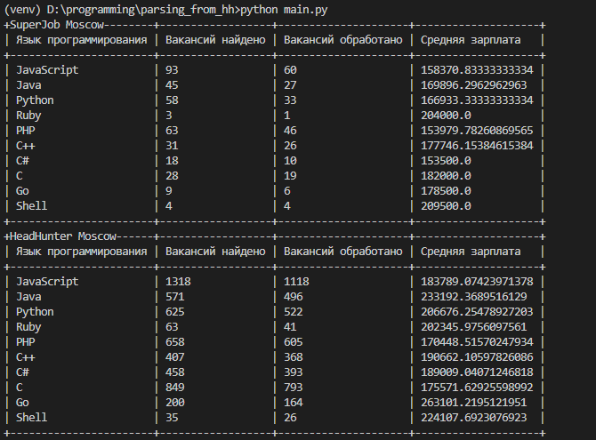

# Parsing jobs from HH and Superjob

Script to parse information on mean salaries, amount of proposals for 10 most popular programming languages



## Setup

To run the script you will need Python third revision

Download the code from GitHub. Install dependencies:

```sh
pip install -r requirements.txt
```

Run the script

```sh
python3 main.py
```

## Environment variables

Part of the project settings is taken from the environment variables. To define them, create a `.env` file next to `main.py` and write data there in the following format: `VARIABLE=value`.

There are 2 variables available:
- `SECRET_KEY` — your application's secret key. To get it please follow instruction [here](https://api.superjob.ru/info/)
- `ACCESS_TOKEN` — your application's access key. To get it please follow instruction [here](https://api.superjob.ru/)


## Project Goals

The code is written for educational purposes - for the course on Python and web development on the site [Devman](https://dvmn.org).
